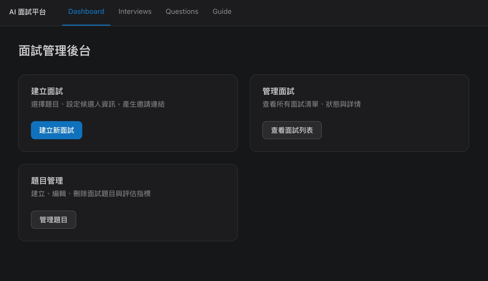
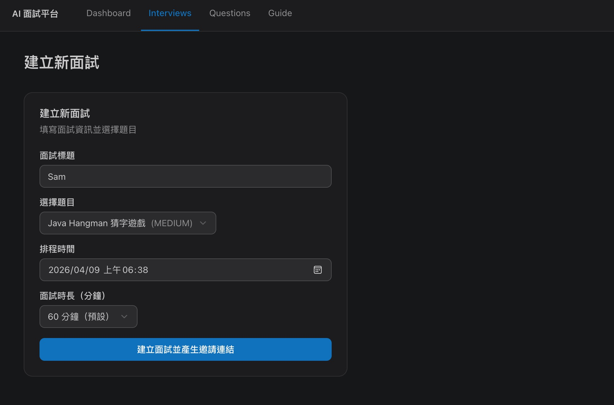
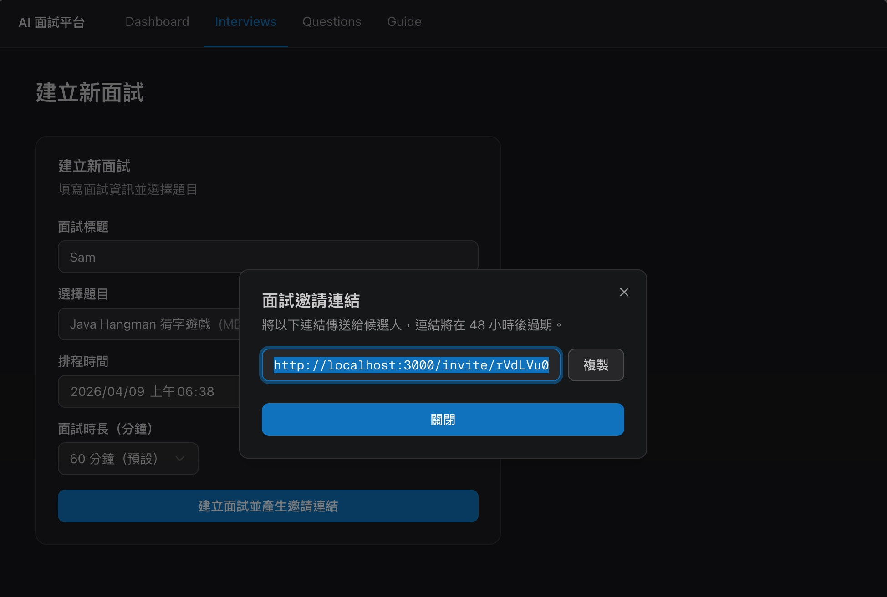
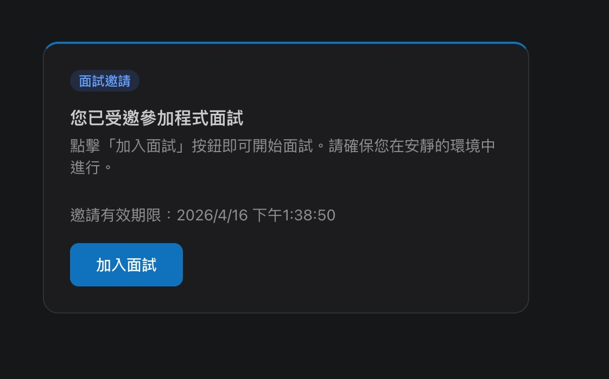
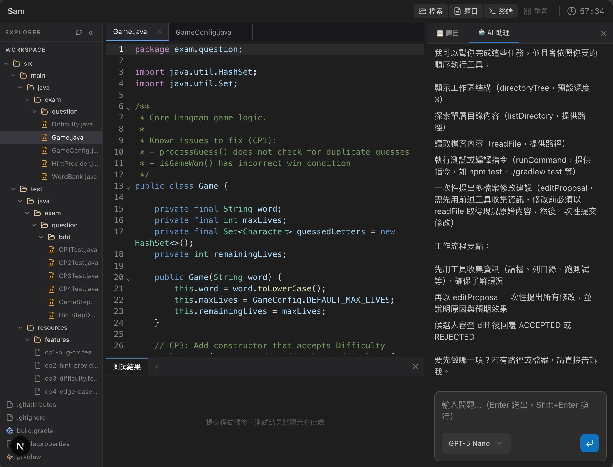

# AI 程式面試平台

> 一個開源、企業級的程式面試平台，靈感來自 **Meta 2025 年正式推出的 AI 輔助程式面試（AI-Enabled Coding Interview）**：在單一無縫體驗中提供多檔案專案工作區、可治理的 AI 助手，以及 Checkpoint 驅動的結構化評分。

[English](./README.md) · [繁體中文](./README.zh-TW.md)

---

## 為什麼有這個專案?

2025 年底，Meta 成為 FAANG 中第一家正式採用 **AI 輔助程式面試** 的公司，呼應了「**82% 的工程師日常已使用 AI 工具**」的現實。面試的考點不再是「你能多快獨自寫出程式碼」，而是 **「你能多有效地思考、提示並與 AI 協作，同時保持良好的工程判斷力」**。

市場缺口非常明顯：沒有任何一個現成產品能在單一體驗中同時涵蓋「真正的多檔案 IDE + 多種 AI 模型 + 即時面試官監控 + AI 互動稽核 + 結構化 Checkpoint 評分」。連 Meta 都得大幅客製化 CoderPad 才能做到，而大多數企業沒有這樣的工程資源。

**這個專案就是為了補上這個缺口。** 它是一個可自架的平台，端到端重現 Meta 的面試格式，讓任何團隊都能用「現代工程師真正的工作方式」來評估候選人。

---

## 畫面截圖

### 後台 — 管理儀表板
HR 與面試官在單一後台管理面試、題目與平台設定。


### 後台 — 建立新面試
選題目、排時間，幾秒內就能產生候選人專屬的邀請連結。


### 後台 — 邀請連結
每場面試都會產生一組獨特、可過期的邀請 URL。


### 候選人 — 邀請頁
候選人進入後會看到簡潔的邀請頁，並在加入前了解規則。


### 候選人 — 面試工作區
完整的多檔案 IDE：檔案樹、CodeMirror 6 編輯器、測試結果面板、互動終端機，以及側邊的 AI 助手與即時模型切換（Gemini、GPT…）。


---

## 主要特色

### 給候選人
- **多檔案專案 IDE**：基於 CodeMirror 6 + 檔案樹 + 多 Tab 切換，不再是 LeetCode 式的單檔輸入框。
- **可治理的 AI 助手**：串流回應（AI SDK v6 + Spring AI）；面試官可以針對每場面試指定允許的模型。
- **Checkpoint 漸進式關卡**：每道題依 Meta 三階段格式拆成 除錯 → 實作 → 最佳化。
- **真實程式碼執行**：沙箱化 Docker 容器執行，看得到真實測試輸出，並內建 xterm.js + WebSocket 互動終端。
- **自動推進流程**：通過一個 checkpoint → 下一階段自動解鎖 → 全部完成 → 完成頁。

### 給面試官 / HR
- **一鍵建立面試**：選題目、排時間、設定 AI 模型政策。
- **邀請機制**：UUID token 邀請連結，可設定過期時間。
- **面試生命週期管理**：`SCHEDULED → ACTIVE → COMPLETED / CANCELLED`，狀態轉換在領域層強制保護。
- **對話歷史與 Checkpoint 結果完整保留**，方便面試後回顧。
- **Pilot AI 評分（Preview）**：以 LLM-as-judge 依 Meta 評分準則產出結構化的 Agency Score。

### 給平台維運者
- **可自架**：一份 Docker Compose 同時啟動後端、兩個前端、PostgreSQL，以及程式碼執行用的 Docker-in-Docker 沙箱。
- **Spring Modulith 模組化單體**：清晰的模組邊界（`interview / execution / invitation / question / ai / scoring`），由 `ModularityTests` 自動驗證；未來要拆成微服務也保留彈性。
- 內建 **Liquibase** schema 遷移、**Spring Data JDBC**（無 JPA 黑魔法）、**Testcontainers** 與 **Cucumber** BDD 場景。

---

## 架構

```
┌─────────────────────┐      ┌─────────────────────┐
│  Admin (Next.js)    │      │ Candidate (Next.js) │
│  port 3000          │      │ port 3001           │
└──────────┬──────────┘      └──────────┬──────────┘
           │   Route Handlers (代理)    │
           └────────────┬───────────────┘
                        ▼
        ┌──────────────────────────────────┐
        │  Spring Boot 4.0 — Modulith      │
        │  ┌────────────────────────────┐  │
        │  │ interview / invitation /   │  │
        │  │ question / execution /     │  │
        │  │ ai / scoring               │  │
        │  └────────────────────────────┘  │
        └────┬──────────┬─────────┬────────┘
             ▼          ▼         ▼
       PostgreSQL    Docker     Gemini /
       17 + Liqui-   sandbox    Spring AI
       base          (DinD)     ChatClient
```

### 技術棧

| 層次          | 選擇                                                                |
| ------------- | ------------------------------------------------------------------- |
| 後端          | Spring Boot **4.0**、Java **21**、Spring Modulith、Spring Data JDBC |
| AI            | Spring AI **2.0.0-M2**（預設 Gemini 3 Flash Preview）              |
| 資料庫        | PostgreSQL **17** + Liquibase                                       |
| 程式碼執行    | Docker（ProcessBuilder）；Roadmap：Firecracker microVM             |
| 前端          | Next.js **16.1**（App Router）、TypeScript、Tailwind CSS 4          |
| 編輯器        | CodeMirror **6**（`@uiw/react-codemirror`）                         |
| AI UI         | AI SDK v6（`useChat` + `DefaultChatTransport`）+ AI Elements        |
| 終端機        | xterm.js + WebSocket                                                |
| Monorepo      | npm Workspaces（`apps/admin`、`apps/candidate`、`packages/shared`） |
| 測試          | JUnit 5、Mockito、Testcontainers、**Cucumber 7** BDD                |

---

## 專案結構

```
ai-coding-interview/
├── backend/              # Spring Boot 4 / Java 21（Gradle Kotlin DSL）
│   └── src/main/java/com/interview/
│       ├── interview/    # 面試 aggregate、Checkpoint 進度
│       ├── invitation/   # 邀請 token 與候選人加入流程
│       ├── question/     # 從 classpath YAML 載入的題庫
│       ├── execution/    # Docker 沙箱程式碼執行
│       ├── ai/           # Spring AI ChatClient + SSE 串流
│       └── scoring/      # LLM-as-judge Agency 評分（Preview）
├── frontend/             # npm Workspaces monorepo
│   ├── apps/admin/       # 面試官 App（port 3000）
│   ├── apps/candidate/   # 候選人 App（port 3001）
│   └── packages/shared/  # 共用型別、API client、UI 元件
├── docs/                 # PRD、設計文件、研究筆記
├── images/               # README 截圖
├── compose.yaml          # 後端本機開發用的 PostgreSQL
├── docker-compose.yml    # 完整全棧的 production-style runtime
└── build-and-run.sh      # 一鍵：build image 並啟動所有服務
```

---

## 開始使用

### 前置需求

- **Docker**（含 Docker Compose v2）
- **JDK 21**
- **Node.js 20+** 與 npm
- **Google Gemini API Key**（`GOOGLE_GENAI_API_KEY`），或任何 Spring AI 支援的 provider

### 方式 A — 一鍵啟動完整全棧

```bash
git clone https://github.com/samzhu/ai-coding-interview.git
cd ai-coding-interview

# 提供 API Key
echo "GOOGLE_GENAI_API_KEY=your-key-here" > .env

./build-and-run.sh
```

腳本完成後：

| 服務          | URL                       |
| ------------- | ------------------------- |
| Admin 後台    | http://localhost:3000     |
| 候選人 App    | http://localhost:3001     |
| 後端 API      | http://localhost:8080     |

### 方式 B — 本機開發模式

```bash
# 1. 後端（PostgreSQL 由 spring-boot-docker-compose 自動啟動）
cd backend
./gradlew bootRun

# 2. Admin App
cd frontend
npm install
npm run dev:admin       # http://localhost:3000

# 3. Candidate App（另一個 Terminal）
npm run dev:candidate   # http://localhost:3001
```

### 走一輪端到端面試

1. 打開 **http://localhost:3000** → 建立新面試 → 選擇題目。
2. 複製產生的邀請連結，到無痕視窗中開啟。
3. 以候選人身份加入面試、寫程式、跑測試、與 AI 助手對話。
4. 看著 Checkpoint 自動推進，直到完成頁。

---

## 測試

```bash
cd backend

./gradlew test                                              # 全部測試（需要 Docker）
./gradlew test --tests "com.interview.*.bdd.*"              # Cucumber BDD 場景
./gradlew test --tests "com.interview.ModularityTests"      # 模組邊界檢查
```

---

## Roadmap

目前已完成（MVP）：

- ✅ 面試生命週期、邀請、多檔案 Checkpoint
- ✅ Docker 沙箱程式碼執行 + 互動終端機
- ✅ 串流 AI 對話與動態模型選擇
- ✅ Pilot LLM-as-judge Agency 評分

下一步：

- 🔮 面試官「跟隨候選人」即時模式 + AI 互動即時面板
- 🔮 完整面試錄製與回放（按鍵級別、多軌道、變速播放）
- 🔮 題目編輯介面 + AI 輔助難度校準
- 🔮 防作弊訊號（Tab 切換、外部貼上、行為分析）
- 🔮 Firecracker microVM 執行後端

完整產品規格請見 [`docs/PRD.md`](./docs/PRD.md)。

---

## 貢獻

非常歡迎 Issue 與 PR。發 PR 前請：

1. 跑 `./gradlew test`，並確保 Modulith 驗證仍通過。
2. 新增的後端行為應該附上 `backend/src/test/resources/features/` 下的 Cucumber feature。
3. 遵循 [`CLAUDE.md`](./CLAUDE.md) 的程式設計原則：易讀性優先、命名具表達力、註解解釋「為什麼」、服務保持無狀態。

---

## License

Apache License 2.0 — 詳見 [`LICENSE`](./LICENSE)。
