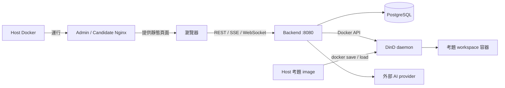
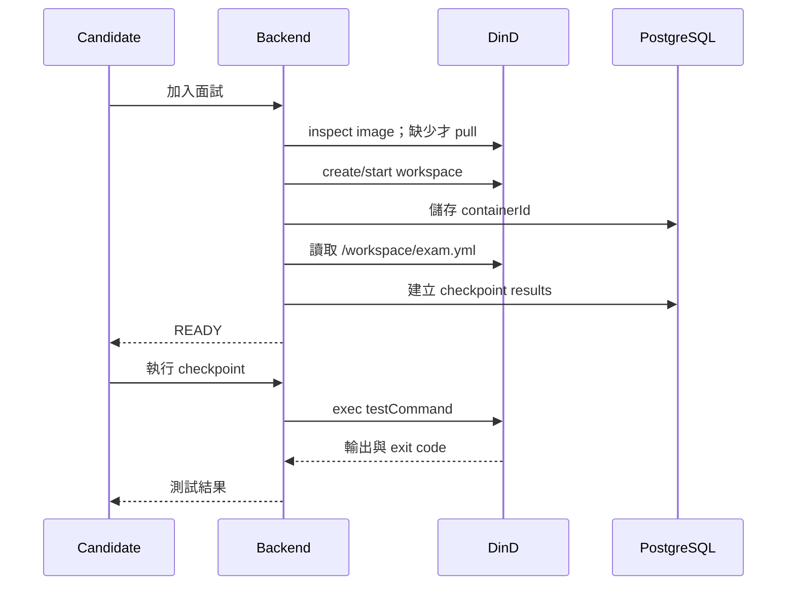

# 開發者本機建置與操作手冊

> 更新：2026-09-09。依目前 working tree 查核；適用 macOS/Linux shell。
> 主線：先 build repo 的 `exams/100`，載入 DinD，再啟動平台並驗收。
> 本次文件整理未重新啟動服務或執行完整面試；下列驗收步驟需在你的環境執行。

## 閱讀與操作順序

1. 了解服務、目錄與題目合約。
2. 準備工具、Compose 與 API key。
3. 編譯考題、部署本機 Docker 環境。
4. 建立面試，驗證 workspace、測試與 AI。
5. 需要修改程式時切換 bootRun 開發模式。
6. 依變更範圍重建，遇到問題使用最後的排查表。

## 1. 先理解平台怎麼運作

建議先開啟 [本機 Docker Compose 互動式架構圖](./architecture/local-docker-compose-architecture.html)，了解 Admin、Candidate、Backend、PostgreSQL、DinD 與考題容器之間的關係，再依本手冊操作。

下載 repo 後可直接用瀏覽器開啟 HTML；macOS 在 repo 根目錄執行：

```bash
open docs/architecture/local-docker-compose-architecture.html
```

GitHub 的檔案頁面會顯示 HTML 原始碼，請下載後開啟。圖的內容與程式內嵌於 HTML，字型使用 Google Fonts；圖中來源連結指向製圖時的版本，實際部署指令與設定以本手冊和目前 repo 為準。

| 元件 | 責任 | 本機入口 |
|---|---|---|
| Admin | 建立面試、取得邀請、監看 | http://localhost:3000 |
| Candidate | 編輯程式、terminal、checkpoint、AI | http://localhost:3001 |
| Backend | REST、SSE、WebSocket、面試流程 | http://localhost:8080 |
| PostgreSQL | 面試、邀請、測試結果、對話資料 | host 5432 |
| DinD | 獨立 Docker daemon，建立考題 workspace | Compose 內部 dind:2375 |
| 考題容器 | 每場面試的程式與執行環境 | 由 Backend 建立 |

前端 Docker image 使用 Next.js static export + Nginx。瀏覽器拿到靜態頁面後，直接向 Backend 發送 API 請求；Nginx 不是這些 API 的代理。[Next.js 官方說明](https://nextjs.org/docs/app/guides/static-exports)



Host Docker 和 DinD 的 image cache 各自獨立。你在 host 執行 docker build，不代表 Backend 連接的 DinD 已經取得 image。

### 1.1 開發者要先認識的檔案

| 路徑 | 修改目的 |
|---|---|
| `build-and-run.sh` | 現有自動建置腳本；只 pull 遠端考題，未 build exams/100 |
| `docker-compose.yml` | 本機完整環境、port、Backend env、前端 build args |
| `backend/build.gradle.kts` | Backend 依賴、Java toolchain、Buildpack image |
| `backend/compose.yaml` | bootRun 使用的 PostgreSQL |
| `backend/src/main/resources/application.yaml` | 模型清單、基礎設定 |
| `backend/config/application-dev.yaml` | bootRun 外部 dev 設定與 secrets import |
| `backend/src/main/resources/questions/question01.yaml` | 下拉題目的 metadata、image tag |
| `exams/100/Dockerfile` | 考題 image build |
| `exams/100/exam.yml` | 真正執行的 checkpoints、排除規則、提示內容 |
| `frontend/package.json` | Admin/Candidate workspace 指令 |

### 1.2 題目 metadata 與考題 image 的差異

`QuestionQueryService` 在啟動時掃描 `classpath:questions/*.yaml`，提供 `GET /api/v1/questions`。題目下拉有內容，僅證明 metadata 可讀。

候選人開始面試後，Backend 才會依 metadata 的 image 建立容器，並從 `/workspace/exam.yml` 讀取 checkpoints。兩項都準備好才可驗收面試。

目前 `exams/100/exam.yml` 是 **3 個 checkpoint、4 個測試類別**：

| Checkpoint | 測試 |
|---|---|
| 1：修復遊戲邏輯 | CP1Test |
| 2：提示功能 | CP2Test |
| 3：難度與防禦性處理 | CP3Test + CP4Test |

`exams/100/question.yml` 與 metadata 描述仍提及 4 張工單，和實際 exam.yml 不一致；平台關卡以 image 內 exam.yml 為準。既有題目設計文件的 SQL seed 範例也不是目前 metadata 的註冊方式。

## 2. 準備本機環境

### 2.1 取得 repo 與確認工具

```bash
git clone https://github.com/samzhu/ai-coding-interview.git
cd ai-coding-interview
docker info
docker compose version
java -version
```

已經有 checkout 就從 repo 根目錄開始，不要重複 clone。

目前版本依據：

- Backend：JDK **25**、Gradle wrapper **9.3.0**、Spring Boot **4.0.5**。
- 考題：`eclipse-temurin:25-jdk`。
- 前端 Docker build：`node:24-alpine`，Next.js **16.1.6**。
- 全 Docker 主線不需 host npm；若跑 frontend dev server，準備 Node 24/npm。
- Docker Desktop 或 OrbStack 必須啟動。主線使用支援 `up --wait --wait-timeout` 的 Compose。

舊 README 與索引有 Java 21 等歷史資訊；目前以 build.gradle.kts 與 Dockerfiles 為準。

### 2.2 確認本機 Compose 存在

```bash
test -f docker-compose.yml
docker compose config --quiet
```

root `docker-compose.yml` 與這份入門手冊已納入版本控制。確認 Compose 有 postgres、dind、backend、admin、candidate 五個 service；舊 checkout 缺少時請更新到包含本手冊的版本。

此 local manifest 以 `ACI_SECURITY_ENABLED=false` 關閉 OAuth2，DinD 的未加密 2375 沒有 publish 到 host。它供本機使用。

### 2.3 設定 API key：Docker 模式

在 repo 根目錄用編輯器建立 `.env`：

```dotenv
POSTGRES_PASSWORD=自行設定本機密碼
GOOGLE_GENAI_API_KEY=
```

Gemini key 可先留空，先驗證題目與執行環境；要驗證 AI 時再填有效值。不要把 key 放进前端 build args 或版本控制。

目前 root Compose 已有 Gemini 對應：

```yaml
# backend.environment 內
ACI_GOOGLE_GENAI_API_KEY: ${GOOGLE_GENAI_API_KEY:-}
```

若要啟用 Claude/OpenAI，在 .env 加上：

```dotenv
ANTHROPIC_API_KEY=
OPENAI_API_KEY=
```

並在 root Compose 的 `backend.environment` **新增**對應；只填 .env 不會自動傳入容器：

```yaml
ACI_ANTHROPIC_API_KEY: ${ANTHROPIC_API_KEY:-}
ACI_OPENAI_API_KEY: ${OPENAI_API_KEY:-}
```

`backend/config/application-secrets.properties` 供 bootRun 使用，**目前 Docker Compose 沒有掛載它**。完整 Docker 模式要透過上述 env 傳遞。

Compose 插值會受 shell 環境變數優先順序影響；若已 export 同名舊 key，更新 .env 後應在新 terminal 操作，或先 unset 該變數。不要把完整 `docker compose config` 輸出貼出，可能包含 secrets。[Docker 插值規則](https://docs.docker.com/compose/how-tos/environment-variables/variable-interpolation/)

### 2.4 模型清單與開关

在 `backend/src/main/resources/application.yaml` 的 `aci.models` 定義模型，支援 google-genai、anthropic、openai。保留 `api-key` placeholder，真實 key 放外部設定。

| 目的 | 操作 |
|---|---|
| 啟用已列出的模型 | 提供對應 key，重啟 Backend |
| 隱藏並停用某模型 | 移除該 models 項目，重建 Backend image |
| 全部停用 | 設 `models: []`，重建 Backend image |
| 換模型 ID | 改項目的 id/name，確認 provider 支援後重建 |

目前沒有每項 `enabled` 欄位。空 key 會跳過 client 建立，但選單仍顯示該模型；聊天找不到選定 client 時，會 fallback 到第一個可用模型。因此「選單顯示」不代表已啟用，空 key 也不保證請求直接報錯。

Candidate 初始化選第一個清單項目；Interview 的 fallback default 另在 Java 內，現值為 gemini-2.5-flash。修改清單順序不會更新既有面試的資料。

## 3. 主線：編譯 exams/100 並部署到本機

以下各步從 repo 根目錄開始。先停下其他占用 3000、3001、8080、5432 的開發服務；不要同時啟動 root stack 和 backend/compose.yaml 的 PostgreSQL。

### 3.1 先建置考題 image

```bash
docker build -t spike19820318/ai-coding-interview-question01:latest exams/100
```

tag 與目前 question01.yaml 完全一致。這只建 local image，不會 push 到該 Docker Hub repository。

Dockerfile 以 exams/100 為 context，`COPY . .` 到 /workspace，執行 `./gradlew testClasses --no-daemon` 下載並編譯 main/test。testClasses 成功代表可編譯，**不是所有測試已通過**。

### 3.2 在 host 驗證 image 合約

```bash
docker run --rm spike19820318/ai-coding-interview-question01:latest \
  bash -lc 'test -f /workspace/exam.yml && test -x /workspace/gradlew && java -version'
docker run --rm spike19820318/ai-coding-interview-question01:latest \
  ./gradlew test --tests 'exam.question.bdd.CP1Test' --no-daemon
```

第二個指令在初始考題上預期有 assertion failure：考題刻意保留 Bug，供候選人修復。確認它有真正執行 CP1 測試，而不是缺 JDK、Gradle wrapper、下載失敗或找不到測試。

不要為了讓環境檢查變綠，就把候選人要解的 Bug 修掉。

### 3.3 建置平台 images

```bash
(cd backend && ./gradlew bootBuildImage -x test)
docker compose build admin candidate
```

Backend image 名称由 Gradle 設為 ai-coding-interview-backend:latest。這次略過 Backend tests 是現行本機 build 慣例；不等於測試已通過。[Spring Boot Buildpack 說明](https://docs.spring.io/spring-boot/gradle-plugin/packaging-oci-image.html)

### 3.4 啟動基礎服務，載入考題到 DinD

```bash
docker compose up -d --wait --wait-timeout 120 postgres dind
```

成功後再執行下列區塊；pipefail 讓 save 或 load 任一側失敗都回傳失敗：

```bash
(
  set -o pipefail
  docker save spike19820318/ai-coding-interview-question01:latest \
    | docker compose exec -T dind docker load
)
docker image inspect spike19820318/ai-coding-interview-question01:latest --format '{{.Id}}'
docker compose exec -T dind docker image inspect \
  spike19820318/ai-coding-interview-question01:latest --format '{{.Id}}'
```

兩邊 image ID 應一致。這是本機測試路徑，不需 Registry push。Backend 只在目標 daemon 缺 image 時 pull，所以提前 load 可使新面試使用本次 build。[Docker save](https://docs.docker.com/reference/cli/docker/image/save/)、[Docker load](https://docs.docker.com/reference/cli/docker/image/load/)

### 3.5 啟動 Backend 與前端

```bash
docker compose up -d backend admin candidate
docker compose ps
```

等待 Backend 真正 ready：

```bash
(
  for attempt in $(seq 1 60); do
    if curl -fsS http://localhost:8080/actuator/health; then
      exit 0
    fi
    sleep 2
  done
  echo "Backend 未於 120 秒內 ready；請查 docker compose logs backend"
  exit 1
)
curl -fsS http://localhost:8080/api/v1/questions
```

health 應為 UP；questions 應含 question1。失敗時停在這一步查 logs，不要直接開始面試。

### 3.6 既有 build-and-run.sh 的適用情境

現行腳本會 build Backend、build 前端、up stack，然後在 DinD **pull 遠端 latest**。它沒有 build exams/100。

因此可用於直接體驗遠端現成題目；要驗證本次 checkout 的考題，使用 3.1～3.5。手動 load 同名 image 後再執行腳本，可能把 tag 更新回遠端版本。

## 4. 建立面試並驗收

1. 開啟 http://localhost:3000/interviews/new/。
2. 填標題、選 Java Hangman、設定時間與時長，建立面試。
3. 使用產生的 invitation link 開啟 Candidate；不要直接把 3001 首頁當邀請。
4. 加入後等待 workspace ready。應看到 Game.java、HintProvider.java 與測試檔。
5. 查看題目面板：依目前本機 exam.yml 應有 3 個 checkpoint。
6. 執行 CP1 測試；初始題目的 assertion failure 是預期。能執行並顯示輸出，才算執行環境驗收通過。
7. 已設定有效 key 時，選擇對應模型送出簡短問題，確認當次 provider 回應。
8. Admin 開啟該場面試監看，確認資料可讀。



健康、題目清單、workspace、測試、AI 是不同驗收層次。API key 未設定時，仍可驗證前四項。

## 5. 修改程式時：bootRun 開發模式

這條模式讓 Backend 跑在 host JVM，PostgreSQL 由 backend/compose.yaml 管理；考題使用 **host Docker**，不用 load 到 DinD。

### 5.1 停止完整環境

在 repo 根目錄執行：

```bash
docker compose stop
```

root PostgreSQL 的 named volume 與 backend/compose.yaml 的資料儲存配置不同；切換模式不能假設原本面試資料會跟著過去。

### 5.2 設定 Backend secrets

用編輯器建立/修改 `backend/config/application-secrets.properties`：

```properties
aci-security-enabled=false
aci-google-genai-api-key=
aci-anthropic-api-key=
aci-openai-api-key=
```

填要用的 provider 即可。外部 application-dev.yaml 從相對路徑 ./config 載入它，所以 Backend 要在 backend 目錄啟動。example 檔含 security=true；本機不使用 OAuth2 時需明確改 false。

### 5.3 準備題目並啟動三個 terminal

尚未 build host image 時，先執行 3.1。確認目前 Java 使用的 Unix socket 與 host Docker 相符；預設為 unix:///var/run/docker.sock，其他 Docker runtime 可用 DOCKER_HOST 指定實際 socket。

Terminal 1，從 repo 根目錄：

```bash
cd backend
./gradlew bootRun
```

Spring Boot 會自動啟動 backend/compose.yaml 的 PostgreSQL，建立 service connection，並執行 Liquibase。其設定使用 local,dev 預設 profiles。[Spring Boot Docker Compose](https://docs.spring.io/spring-boot/4.0/reference/features/dev-services.html)

Terminal 2，從 repo 根目錄：

```bash
cd frontend
npm ci
NEXT_PUBLIC_CANDIDATE_URL=http://localhost:3001 npm run dev:admin
```

Terminal 3，從 repo 根目錄：

```bash
cd frontend
npm run dev:candidate
```

Admin 的 Candidate URL 明確指定為 3001，避免邀請連結 fallback 到 Admin 3000。預設 dev HTTP API 由 Next.js rewrite 代理到 8080；WebSocket 直接連 Backend。

若改用環境變數傳 key，需使用 ACI_GOOGLE_GENAI_API_KEY 等名稱；單獨 export GOOGLE_GENAI_API_KEY 並不等同於 root Compose 的明確映射。

## 6. 日常修改、重建與重啟

| 改了什麼 | Docker 模式要做什麼 |
|---|---|
| .env key 或 Compose env | recreate Backend；不需重建 image |
| Backend Java、resources、模型清單 | bootBuildImage，再 recreate Backend |
| exams/100 程式或 exam.yml | build 題目、save/load 到 DinD，再建立新面試 |
| metadata image tag | 重建 Backend，確保 DinD 有對應 tag |
| 前端程式、NEXT_PUBLIC_API_BASE | build 前端 images，再 recreate |
| 只想暫停/恢復 | compose stop / start |

只更新 Backend 環境變數：

```bash
docker compose up -d --force-recreate backend
```

Backend 重建：

```bash
(cd backend && ./gradlew bootBuildImage -x test)
docker compose up -d --force-recreate backend
```

前端重建：

```bash
docker compose build admin candidate
docker compose up -d --force-recreate admin candidate
```

重啟後重跑 health 與相應功能驗收。單純 docker compose restart 不會套用新的 container env。[Docker restart](https://docs.docker.com/reference/cli/docker/compose/restart/)

修改考題後，既有面試容器仍保留建立當時的內容，exam.yml 也有每容器快取。用新面試驗證新 image，避免誤判修改未生效。

### 6.1 新增第二張考題

1. 建立獨立目錄，準備 source、Gradle wrapper、tests、exam.yml、Dockerfile。
2. 沿用 exams/100 的 flat layout：COPY . . 後 /workspace/exam.yml 必須存在。
3. 使用不同 image tag build，逐一執行 exam.yml 的 testCommand。
4. 新增 backend/src/main/resources/questions/*.yaml，使用唯一 id 和完整 image tag。
5. 本機用 save/load；共享 image 時才 push 到你有權限的 Registry。
6. 重建 Backend，確認 questions API 出現新 id，建立新面試。

```yaml
id: question2
title: 第二張 Java 考題
language: java
difficulty: MEDIUM
image: local/question02:v1
description: |
  題目說明
```

題目測試應有明確的初始失敗原因與完成後的預期；不要把依賴下載失敗誤當題目失敗。exclude 只是檔案顯示過濾，不是 OS 存取控制；目前不能靠它保證 terminal 裡的測試檔唯讀。

## 7. 故障排查：先找失敗的層

```bash
docker compose ps -a
docker compose logs --tail=200 backend
curl -i http://localhost:8080/actuator/health
curl -i http://localhost:8080/api/v1/questions
docker compose exec -T dind docker info
```

分享 log 前刪除 keys、tokens、候選人對話等內容。現行 DEBUG AI logger 可能記錄完整 prompt。

| 現象/證據 | 判讀與處理 |
|---|---|
| Backend connection refused | 檢查 container 是否退出與第一個 Caused by |
| 缺 JwtDecoder | 本機 Compose 設 ACI_SECURITY_ENABLED=false；bootRun 設 aci-security-enabled=false |
| 5432 occupied / No host port mapping found | 檢查 root/backend 兩套 Compose 與其他 PostgreSQL；確認实际 port mapping 後處理 |
| 下拉空但 questions 回 200 且有題目 | 查瀏覽器 Network、API URL、CORS；目前前端 catch 將錯誤變空陣列 |
| questions 回 [] | 檢查 classpath questions/*.yaml 是否打包、Backend image 是否更新 |
| YAML 解析失敗 | 載入在啟動時發生，可能直接使 Backend 啟動失敗 |
| metadata 可見、workspace 初始化失敗 | 查 DinD image、image tag、Docker 連線與初始化 log |
| exam.yml 找不到 | 檢查 image 內 /workspace/exam.yml；目前程式可能仍標 READY 但沒有關卡 |
| 測試 assertion failure | 初始 Bug 題目預期；對照 test case |
| 測試無法啟動/找不到 wrapper | 檢查 image 的 build context、執行權限、依賴 |
| AI 未設定 | key 未建立 client；查看 Registered/Skipping model log |
| Google 400 API key not valid | provider 拒絕傳入值；換有效 key，recreate；不能只據此斷言哪個 key 限制出錯 |
| 429 | 查配額與速率限制 |
| 選 Claude 卻由 Gemini 回答 | 選定 client 不存在會 fallback；查註冊 log、補 key 或移除不可用項目 |

`GET /api/v1/ai/models` 只證明清單設定存在；`Registered AI model` 證明 client 已建立；真正 provider 回應才證明 key/model 可用。[Gemini key 管理](https://ai.google.dev/gemini-api/docs/api-key)、[錯誤排查](https://ai.google.dev/gemini-api/docs/troubleshooting)

### 7.1 停止與資料保存

```bash
docker compose stop
# 需要移除服務容器時
docker compose down
```

一般操作保留 volumes。down -v 會刪 root Compose 管理的 PostgreSQL/DinD volumes，不能當成一般重啟。更新 PostgreSQL .env 密碼也不會自動替已初始化的資料庫角色改密碼。

考題容器的 workspace 有面試期間狀態；不要把重新 build image 當備份。Backend 的資料庫狀態與外部 workspace 應分開理解，本機部署步驟不代表已驗證多副本無狀態部署。

## 8. 驗收清單與來源

- [ ] Host 考題 image build 成功，exam.yml 與 wrapper 存在。
- [ ] DinD image ID 與本次 host build 相同。
- [ ] health UP、questions API 有 question1。
- [ ] 新面試 workspace 可讀、顯示 3 個 checkpoints。
- [ ] CP1 真正執行，初始 assertion failure 符合題目設計。
- [ ] 所需 AI provider 有當次成功回應。
- [ ] 改考題後使用新面試驗證，沒有沿用舊容器。

程式證據：

- [啟動腳本](../build-and-run.sh)、[本機 Compose](../docker-compose.yml)、[Backend build](../backend/build.gradle.kts)
- [題目 metadata](../backend/src/main/resources/questions/question01.yaml)、[考題 Dockerfile](../exams/100/Dockerfile)、[考題合約](../exams/100/exam.yml)
- [QuestionQueryService](../backend/src/main/java/com/interview/question/application/QuestionQueryService.java)、[ExamConfigService](../backend/src/main/java/com/interview/execution/ExamConfigService.java)
- [DockerContainerManager](../backend/src/main/java/com/interview/execution/internal/DockerContainerManager.java)、[ContainerInitializationService](../backend/src/main/java/com/interview/interview/application/ContainerInitializationService.java)
- [模型 Registry](../backend/src/main/java/com/interview/ai/internal/AiModelRegistry.java)、[聊天 fallback](../backend/src/main/java/com/interview/ai/application/AiChatService.java)
- [Frontend API client](../frontend/packages/shared/src/lib/api-client.ts)

官方操作參考：

- [Compose up / wait](https://docs.docker.com/reference/cli/docker/compose/up/)
- [Docker build 最佳實踐](https://docs.docker.com/build/building/best-practices/)
- [Compose 環境變數最佳實踐](https://docs.docker.com/compose/how-tos/environment-variables/best-practices/)
- [本機部署查核備忘錄](./infrastructure/local-setup-verification.md)

本次檢查範圍是程式碼、設定、文件命令與官方行為查核；未宣稱已重新完成 clean-clone E2E。入門手冊、查核備忘錄與 root Compose 隨 repo 交付；其他本機研究文件與生成圖檔仍保持忽略。
